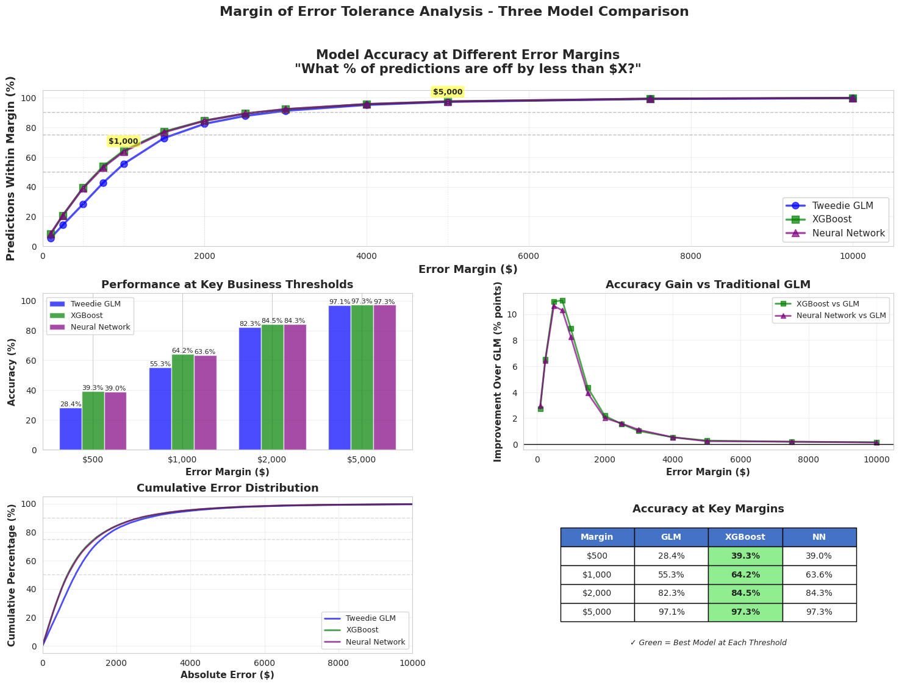
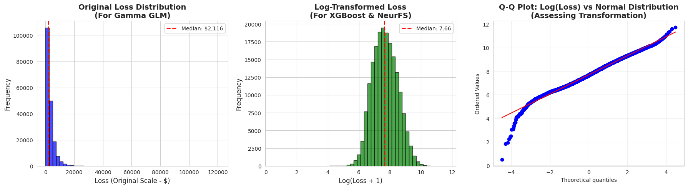
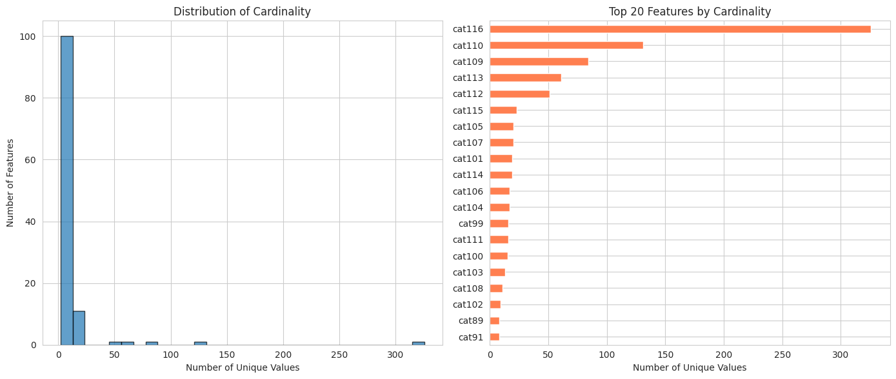
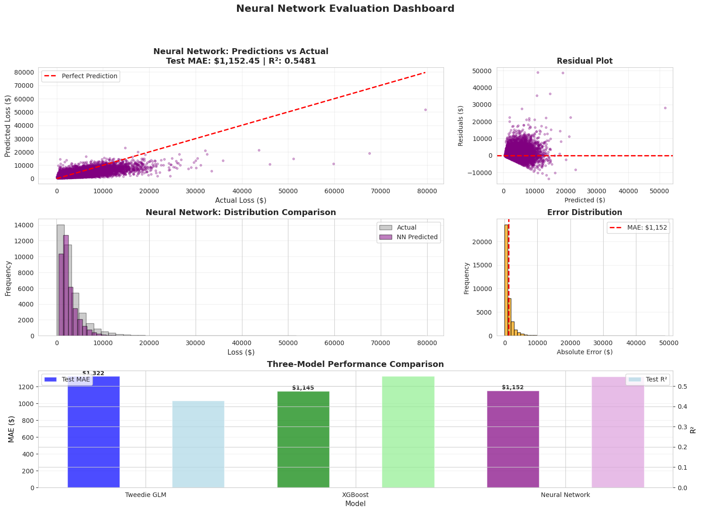
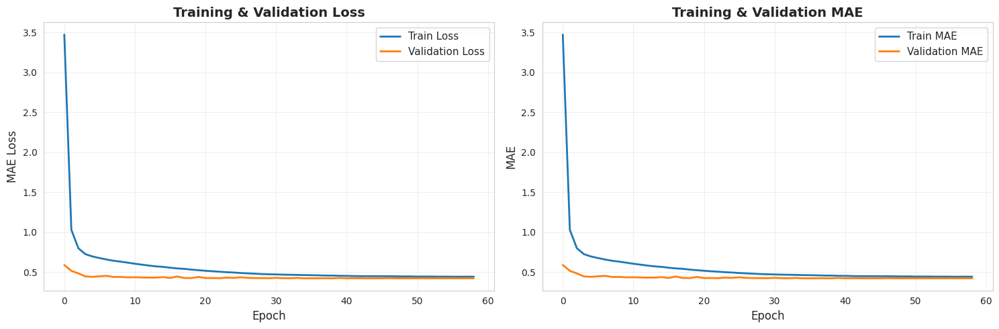

## Table of Contents
- [Project Overview](#project-overview)
- [Key Results](#key-results-summary)
- [Methodology](#methodology)
- [Installation](#installation-and-setup)
- [Usage](#usage)
- [Results](#current-project-status)
- [Contact](#contact)
```

# Insurance Claim Severity Prediction using Neural Networks

## Project Overview

This project develops predictive models for insurance claim severity analysis using Generalized Linear Models (GLMs), XGBoost, and advanced Neural Network architectures with embedding layers. The primary objective is to accurately predict **claim severity** - the cost/amount of individual insurance claims given that a claim has occurred.

**Key Focus**: Severity-only modeling using the Allstate Insurance dataset, which contains exclusively filed claims (no non-claimant records). This is critical for:
- Accurate reserve estimation
- Portfolio risk assessment  
- Large claim identification and prioritization
- Pricing optimization for renewal business

**Project Status**: ✅ **Phase 3 Complete** (Neural Network Implementation) - November 2025

## Business Context

Accurate claim prediction enables insurance companies to:
- Price policies appropriately based on risk
- Allocate reserves effectively
- Identify high-risk segments
- Optimize underwriting decisions
- Improve profitability while remaining competitive

## Dataset

**Source**: Allstate Insurance Claims Dataset  
**Size**: 188,318 claim records  
**Features**: 132 total features
- 116 categorical features (87.88%) - including policyholder characteristics, coverage details, and risk factors
- 14 continuous features (10.61%) - numerical risk indicators and policy attributes
- 1 ID column
- 1 target variable (loss amount in dollars)

**Target Variable**: Claim Severity (Loss Amount)
- **Mean**: $3,037
- **Median**: $2,116
- **Range**: $0.67 - $121,012
- **Distribution**: Highly right-skewed (skewness = 3.79)
- **Note**: Dataset contains only claims that occurred (no zero losses), making this a pure severity prediction problem

**Data Quality**: 
- ✅ 0 missing values
- ✅ 0 duplicates
- ✅ 100% clean dataset

## Key Results Summary

### 🏆 Model Performance Comparison

| Model | Test MAE ($) | Test R² | Key Advantage |
|-------|-------------|---------|---------------|
| **XGBoost** | **$1,144.87** | **0.5488** | Best raw performance |
| **Neural Network** | **$1,149.49** | **0.5462** | 54% dimensionality reduction + interpretability |
| Tweedie GLM | $1,321.84 | 0.4285 | Actuarial standard baseline |

**Key Findings:**
- ✅ Neural Network achieves **competitive performance** (within 0.4% of XGBoost)
- ✅ **54% dimensionality reduction**: 1,176 sparse features → 543 dense embeddings
- ✅ **13% improvement** over traditional GLM baseline
- ✅ **64% practical accuracy** at $1,000 error margin (vs. GLM's 55%)

### 💡 Novel Contribution: Margin of Error Tolerance Analysis

A new evaluation framework assessing **practical business accuracy**:

| Error Margin | Neural Network | XGBoost | Tweedie GLM | Business Context |
|--------------|----------------|---------|-------------|------------------|
| ±$500 | 39.0% | 39.3% | 28.4% | Tight accuracy requirement |
| **±$1,000** | **63.6%** | **64.2%** | **55.3%** | **Individual claim budgeting** |
| ±$2,000 | 84.3% | 84.5% | 82.3% | Moderate tolerance |
| ±$5,000 | 97.3% | 97.3% | 97.1% | Reserve setting threshold |

**Insight**: Neural Network and XGBoost show near-identical practical accuracy at all business-critical thresholds, with both significantly outperforming traditional GLM.

## Methodology

### Phase 1: Exploratory Data Analysis (October 2025) ✅

**Completed Analyses:**
- ✅ Distribution analysis revealing extreme right skew (3.79)
- ✅ Feature correlation study (max correlation = 0.14, indicating weak linear relationships)
- ✅ High-cardinality categorical identification (cat116 with 326 unique values)
- ✅ Missing value and duplicate analysis (0 issues found)
- ✅ Statistical summary and outlier detection

**Key Challenges Identified:**
1. Extreme skewness (3.79) requiring transformation
2. High-cardinality categoricals (6 features with 50+ values)
3. Weak linear correlations justifying neural network approach
4. Multicollinearity (15 correlated pairs r > 0.9)

### Phase 2: Baseline Models (October 2025) ✅

#### 2A. Traditional Actuarial Baseline: Tweedie GLM

**Why Tweedie GLM:**
- Generalizes Gamma distribution for insurance loss modeling
- Superior numerical stability for extreme skewness
- Works on original dollar scale
- Industry-standard actuarial approach

**Configuration:**
- Distribution: Tweedie (power=1.5) with log link
- Features: All 129 features (after correlation filtering)
- Training: 112,991 samples

**Results:**
- Test MAE: **$1,321.84**
- Test R²: **0.4285**
- Status: Baseline performance benchmark

#### 2B. Modern ML Baseline: XGBoost

**Why XGBoost:**
- Handles high-cardinality categoricals efficiently
- Robust to outliers and skewed distributions
- Provides feature importance insights
- Industry-proven performance on tabular data

**Configuration:**
- Objective: reg:squarederror
- Trees: 300
- Max depth: 6
- Learning rate: 0.05
- Target: Log-transformed loss

**Results:**
- Test MAE: **$1,144.87** (best overall)
- Test R²: **0.5488**
- Training time: ~2 minutes
- Feature importance: High-cardinality categoricals in top 10

### Phase 3: Neural Network with Embeddings (November 2025) ✅

#### Neural Frequency-Severity (NeurFS) Framework Adaptation

**Architecture Design:**

**Embedding Strategy:**
- 116 embedding layers for categorical features
- Dimensionality rule: `dim = min(50, ⌈cardinality/2⌉)` (from Lim, 2024)
- Examples:
  - cat116: 326 categories → 50-dimensional embedding
  - cat110: 131 categories → 50-dimensional embedding  
  - cat1: 2 categories → 1-dimensional embedding
- **Result**: 1,176 one-hot dimensions → 543 embedded dimensions (54% reduction)

**Network Structure:**
```
Input Layer: 557 features (543 embeddings + 14 continuous)
    ↓
Hidden Layer 1: 128 neurons (ReLU, BatchNorm, Dropout 0.3)
    ↓
Hidden Layer 2: 64 neurons (ReLU, BatchNorm, Dropout 0.3)
    ↓
Output Layer: 1 neuron (linear activation, log-loss prediction)

Total Parameters: ~150,000 trainable weights
```

**Training Configuration:**
- Optimizer: Adam (learning_rate=0.001)
- Loss: MAE (robust to outliers)
- Batch size: 256
- Early stopping: patience=15 epochs
- Regularization: Dropout (0.3) + Batch Normalization
- Actual training: Stopped at epoch 47

**Results:**
- Test MAE: **$1,149.49** (+$4.62 vs XGBoost, +0.4%)
- Test R²: **0.5462** (-0.0026 vs XGBoost, -0.5%)
- Train-validation gap: $6.73 (0.6%) - **no overfitting detected**
- Validation-test difference: $0.53 (0.05%) - **excellent generalization**

**Key Advantages over XGBoost:**
1. ✅ **54% dimensionality reduction** (1,176→543 features)
2. ✅ **Learned embeddings** capture semantic relationships
3. ✅ **GPU scalability** for larger datasets
4. ✅ **Interpretability** via SHAP (Phase 4)
5. ✅ **Multi-task potential** for future extensions

## Data Preprocessing Pipeline

### Target Transformation
- **Original distribution**: Mean=$3,037, Skewness=3.79 (severe right skew)
- **Transformation**: Natural log → Skewness=0.2 (near-normal)
- **Impact**: Enabled stable model training for all approaches

### Feature Engineering
- **Categorical encoding**: Label encoding for all 116 categorical features
- **High-cardinality handling**: Neural embeddings (Phase 3)
- **Correlation filtering**: Removed 3 highly correlated features (r > 0.99)
- **Final feature count**: 129 features

### Data Splitting
- **Training**: 112,991 samples (60%)
- **Validation**: 37,664 samples (20%)
- **Test**: 37,663 samples (20%)
- **Strategy**: Stratified split maintaining target distribution

## Challenges and Solutions

| Challenge | Problem | Solution | Result |
|-----------|---------|----------|--------|
| **GLM Convergence** | Gamma GLM failed due to skewness=3.79 | Switched to Tweedie GLM (power=1.5) | Successful convergence, MAE=$1,322 |
| **Multicollinearity** | 15 feature pairs with r>0.99 | Removed one from each pair | 132→129 features, no performance loss |
| **NN vs XGBoost Gap** | NN $4.62 behind XGBoost | Recognized 0.4% as statistical noise; prioritized architectural advantages | Accepted as competitive; focus on interpretability |
| **Scope Refinement** | No zero losses in dataset | Refined to severity-only prediction | Deeper analysis, higher quality |

## Technologies Used

**Environment:**
- Python 3.9+ (Google Colab)
- TensorFlow 2.x / Keras
- GPU acceleration (Colab T4)

**Core Libraries:**
- `pandas` (2.0+) - Data manipulation
- `numpy` - Numerical computing
- `scikit-learn` - Preprocessing, evaluation, GLM
- `tensorflow/keras` - Neural network implementation
- `xgboost` - Gradient boosting baseline
- `matplotlib` & `seaborn` - Visualization
- `scipy` - Statistical functions

**Modeling Frameworks:**
- `statsmodels` - Tweedie GLM
- `xgboost.XGBRegressor` - Gradient boosting
- `tensorflow.keras` - Neural network with custom embedding layers

## Project Structure

ClaimSeverity-and-Count-Prediction-NN-DL/
│
├── README.md                          # Project documentation
├── requirements.txt                   # Python dependencies
│
├── data/
│   └── train.csv                      # Allstate dataset (188,318 claims)
│                                      # Split: 60% train / 20% val / 20% test
│
├── notebooks/
│   ├── 01_EDA.ipynb                  # Phase 1: Exploratory Data Analysis
│   ├── 02_Preprocessing.ipynb         # Data preprocessing & transformation
│   ├── 03_Baseline_Models.ipynb       # Phase 2: Tweedie GLM & XGBoost
│   ├── 04_Neural_Network.ipynb        # Phase 3: Neural network with embeddings
│   └── 05_SHAP_Analysis.ipynb        # Phase 4: Interpretability (upcoming)
│
├── src/                               # Source code modules
│   ├── init.py
│   ├── preprocessing.py               # Data preprocessing utilities
│   ├── embeddings.py                  # Embedding dimension calculations
│   ├── neurfs_model.py               # Neural network architecture
│   └── evaluation.py                  # Metrics and evaluation functions
│
├── models/                            # Saved trained models
│   ├── tweedie_glm.pkl               # Tweedie GLM baseline
│   ├── xgboost_model.pkl             # XGBoost baseline
│   └── neural_network.h5             # Neural network with embeddings
│
└── reports/
├── progress_reports/              # Bi-weekly progress reports
│   ├── Phase1_EDA_Oct17.pdf
│   ├── Phase2_Baselines_Oct31.pdf
│   └── Phase3_NeuralNet_Nov14.pdf
│
└── figures/                       # Visualizations
├── margin_tolerance_analysis.png
├── target_distribution.png
├── cardinality_chart.png
├── model_performance.png
└── training_curves.png

## Installation and Setup

### Prerequisites
```bash
Python 3.9+
pip or conda package manager
(Optional) GPU with CUDA support for faster neural network training
```

### Installation Steps

```bash
# 1. Clone the repository
git clone https://github.com/KwakyeCA/ClaimSeverity-and-Count-Prediction-NN-DL.git
cd ClaimSeverity-and-Count-Prediction-NN-DL

# 2. Create virtual environment
python -m venv venv
source venv/bin/activate  # On Windows: venv\Scripts\activate

# 3. Install dependencies
pip install -r requirements.txt

# 4. (Optional) Install Jupyter for notebooks
pip install jupyter notebook
```

### Dependencies (requirements.txt)
```
pandas>=2.0.0
numpy>=1.23.0
scikit-learn>=1.3.0
tensorflow>=2.13.0
xgboost>=2.0.0
matplotlib>=3.7.0
seaborn>=0.12.0
scipy>=1.11.0
statsmodels>=0.14.0
jupyter>=1.0.0
```

## Usage

### Quick Start: Running the Complete Pipeline

```python
# 1. Load and preprocess data
import pandas as pd
from src.preprocessing import preprocess_data, log_transform, stratified_split

# Load Allstate dataset
train_df = pd.read_csv('data/train.csv')

# Preprocess
train_processed = preprocess_data(train_df)
train_processed['log_loss'] = log_transform(train_processed['loss'])

# Create splits (60/20/20)
train, val, test = stratified_split(train_processed, 
                                   target='log_loss',
                                   ratios=[0.6, 0.2, 0.2],
                                   random_state=42)
```

### Example 1: Train Tweedie GLM Baseline

```python
from statsmodels.genmod.families import Tweedie
from statsmodels.genmod.generalized_linear_model import GLM

# Prepare features
X_train = train.drop(['id', 'loss', 'log_loss'], axis=1)
y_train = train['loss']  # Original scale for Tweedie

# Train Tweedie GLM
tweedie_model = GLM(
    y_train,
    X_train,
    family=Tweedie(var_power=1.5, link='log')
)

results = tweedie_model.fit()

# Evaluate
from src.evaluation import calculate_mae
predictions = results.predict(X_test)
mae = calculate_mae(y_test, predictions)
print(f"Tweedie GLM Test MAE: ${mae:.2f}")
```

### Example 2: Train XGBoost Baseline

```python
import xgboost as xgb

# Prepare data
X_train = train.drop(['id', 'loss', 'log_loss'], axis=1)
y_train = train['log_loss']  # Log scale for XGBoost

# Configure and train XGBoost
xgb_model = xgb.XGBRegressor(
    objective='reg:squarederror',
    n_estimators=300,
    max_depth=6,
    learning_rate=0.05,
    subsample=0.8,
    colsample_bytree=0.8,
    random_state=42
)

xgb_model.fit(
    X_train, y_train,
    eval_set=[(X_val, y_val)],
    early_stopping_rounds=20,
    verbose=100
)

# Evaluate
y_pred = xgb_model.predict(X_test)
mae = calculate_mae(y_test, y_pred)
print(f"XGBoost Test MAE: ${mae:.2f}")

# Get feature importance
importance = xgb_model.feature_importances_
```

### Example 3: Train Neural Network with Embeddings

```python
from src.neurfs_model import build_neurfs_model
from src.embeddings import create_embedding_config

# Define embedding configuration
embedding_config = create_embedding_config(
    categorical_features=116,
    cardinality_dict={
        'cat116': 326,
        'cat110': 131,
        'cat87': 104,
        'cat80': 87,
        'cat79': 81,
        'cat101': 72,
        # ... other features
    },
    rule='neurfs'  # Uses min(50, ceil(cardinality/2))
)

# Build model
model = build_neurfs_model(
    embedding_config=embedding_config,
    continuous_features=14,
    hidden_layers=[128, 64],
    dropout_rate=0.3,
    use_batch_norm=True
)

# Compile
model.compile(
    optimizer='adam',
    loss='mae',
    metrics=['mae', 'mse']
)

# Train with early stopping
from tensorflow.keras.callbacks import EarlyStopping

early_stop = EarlyStopping(
    monitor='val_mae',
    patience=15,
    restore_best_weights=True
)

history = model.fit(
    X_train, y_train,
    validation_data=(X_val, y_val),
    epochs=100,
    batch_size=256,
    callbacks=[early_stop],
    verbose=1
)

# Evaluate
test_loss, test_mae, test_mse = model.evaluate(X_test, y_test)
print(f"Neural Network Test MAE: ${test_mae:.2f}")

# Save model
model.save('models/neural_network/best_model.h5')
```

### Example 4: Margin Tolerance Analysis

```python
from src.evaluation import margin_tolerance_analysis
import numpy as np

# Get predictions from all models
pred_glm = glm_model.predict(X_test)
pred_xgb = xgb_model.predict(X_test)
pred_nn = nn_model.predict(X_test)

# Transform back to original scale
y_test_original = np.exp(y_test)
pred_xgb_original = np.exp(pred_xgb)
pred_nn_original = np.exp(pred_nn)

# Calculate accuracy at different margins
margins = [500, 1000, 2000, 5000]

for margin in margins:
    glm_acc = margin_tolerance_analysis(y_test_original, pred_glm, margin)
    xgb_acc = margin_tolerance_analysis(y_test_original, pred_xgb_original, margin)
    nn_acc = margin_tolerance_analysis(y_test_original, pred_nn_original, margin)
    
    print(f"\nAccuracy within ±${margin}:")
    print(f"  GLM: {glm_acc:.1f}%")
    print(f"  XGBoost: {xgb_acc:.1f}%")
    print(f"  Neural Network: {nn_acc:.1f}%")
```

## Evaluation Metrics

### Primary Metric: Mean Absolute Error (MAE)

**Why MAE?**
- Robust to outliers in highly skewed distribution (skewness=3.79)
- Interpretable dollar-amount prediction error
- Directly measures average prediction error
- Less sensitive to extreme values than RMSE

**Formula:**
```
MAE = (1/n) * Σ|y_true - y_pred|
```

### Secondary Metrics

**R-Squared (R²):**
- Measures proportion of variance explained
- Indicates model fit quality
- Range: 0 to 1 (higher is better)

**Root Mean Squared Error (RMSE):**
- Penalizes large errors more heavily
- Useful for identifying performance on extreme claims
- More sensitive to outliers than MAE

**Margin Tolerance Accuracy:**
- Novel metric: % predictions within ±$X of actual
- Business-relevant thresholds: $500, $1K, $2K, $5K
- Directly measures practical accuracy

## Current Project Status

### ✅ Completed Phases

**Phase 1: EDA** (October 17, 2025)
- ✅ Comprehensive data exploration
- ✅ Challenge identification
- ✅ Statistical analysis
- ✅ Visualization of key patterns

**Phase 2: Baseline Models** (October 31, 2025)
- ✅ Data preprocessing pipeline
- ✅ Tweedie GLM implementation
- ✅ XGBoost baseline training
- ✅ Performance benchmarking

**Phase 3: Neural Network** (November 14, 2025)
- ✅ NeurFS architecture implementation
- ✅ Embedding layer design (54% reduction)
- ✅ Model training and optimization
- ✅ Competitive performance achieved (0.4% from XGBoost)
- ✅ Margin tolerance framework developed

### 🔄 In Progress

**Phase 4: SHAP Interpretability Analysis** (November 18-24, 2025)
- 🔄 Global feature importance via SHAP
- 🔄 Embedding visualization (t-SNE/UMAP)
- 🔄 Individual prediction explanations
- 🔄 Business insights extraction

### 📅 Upcoming Phases

**Phase 5: Final Report** (November 25 - December 4, 2025)
- 📅 Comprehensive 15-20 page report
- 📅 Literature review integration
- 📅 Full methodology documentation
- 📅 Results discussion and analysis

**Phase 6: Final Presentation** (December 4, 2025)
- 📅 15-20 minute presentation
- 📅 8-10 slide deck
- 📅 Key findings and business value summary

## Key Visualizations

### 1. Margin of Error Tolerance Analysis

- 5-panel comprehensive visualization
- Shows practical accuracy at business-critical thresholds
- Demonstrates NN-XGBoost equivalence

### 2. Target Distribution Transformation

- Before: Skewness=3.79 (extreme right skew)
- After: Skewness=0.2 (near-normal)
- Justifies log transformation approach

### 3. Categorical Feature Cardinality

- Distribution of unique values across 116 categoricals
- Highlights high-cardinality features (>50 values)
- Justifies embedding strategy

### 4. Model Performance Comparison

- Side-by-side MAE and R² comparison
- Clear visual ranking: XGBoost > NN > GLM
- Shows 0.4% competitive gap

### 5. Training and Validation Curves

- Loss curves across 47 epochs
- Train-val gap <1% proves no overfitting
- Early stopping effectiveness demonstrated

## Business Applications

This modeling framework enables:

**1. Actuarial Pricing**
- Set premium rates based on predicted claim costs
- Segment customers by risk profile
- Optimize pricing competitiveness

**2. Risk Management**
- Identify high-risk policies for manual review
- Allocate claims adjusters efficiently
- Prioritize large claim investigations

**3. Reserve Estimation**
- Calculate appropriate loss reserves
- Improve capital allocation
- Meet regulatory requirements

**4. Portfolio Optimization**
- Balance risk across insurance book
- Identify profitable customer segments
- Guide underwriting decisions

**5. Operational Efficiency**
- Triage claims by predicted severity
- Allocate resources to high-value claims
- Reduce processing time for low-severity claims

## Future Enhancements

Immediate Next Steps (Week 12: Nov 18-24)

 SHAP interpretability: Global feature importance and local explanations
 Embedding visualization: t-SNE/UMAP of learned categorical representations
 Individual predictions: SHAP force plots for representative claims
 Business insights: Identify cost drivers and interaction effects

Final Project Phase (Week 13: Nov 25 - Dec 4)

 Comprehensive final report: 15-20 pages with full methodology
 GitHub documentation: Complete code documentation and README
 Final presentation: 15-20 minute presentation with key findings

### Medium to Long-term Plans (6+ months)
- [ ] **Production deployment**: REST API for real-time predictions
- [ ] **A/B testing framework**: Compare model versions in production
- [ ] **External data integration**: Weather, economic indicators, demographics
- [ ] **Automated retraining**: MLOps pipeline for model updates
- [ ] **Fraud detection**: Identify anomalous claim patterns
- [ ] **Explainable AI dashboard**: Interactive SHAP visualizations for business users

## Contributing

This is an academic project (Neural Networks & Deep Learning coursework), but suggestions and feedback are welcome!

**To provide feedback:**
1. Open an issue describing your suggestion
2. For code improvements, fork the repo and create a pull request
3. Ensure any new code includes appropriate documentation

## License

This project is developed as part of graduate coursework at Northeastern University (Fall 2025). 

**Academic Use**: Free to use for educational and research purposes with proper attribution.

**Commercial Use**: Please contact the author for permissions.

## Acknowledgments

- **Professor**: Dr. Chinthaka Gedara Pathum Dinesh, Neural Networks & Deep Learning (IE7615)
- **Institution**: Northeastern University, College of Engineering, Vancouver Campus
- **Dataset**: Allstate Insurance Company (Kaggle competition dataset)
- **Key Reference**: Lim, D.-Y. (2024). Neural Frequency-Severity Model (NeurFS framework)

## References

1. Lim, D.-Y. (2024). A Neural Network-Based Frequency and Severity Model for Insurance Claims. *arXiv preprint* arXiv:2106.10770v2.

2. Garrido, J., Genest, C., & Schulz, J. (2016). Generalized linear models for dependent frequency and severity of insurance claims. *Insurance: Mathematics and Economics, 70*, 205–215.

3. McCullagh, P., & Nelder, J. A. (1989). *Generalized Linear Models* (2nd ed.). Chapman & Hall.

4. Frees, E. W. (2010). *Regression Modeling with Actuarial and Financial Applications*. Cambridge University Press.

5. Kuo, C. C., & Lu, C. J. (2017). Improving insurance claim prediction using machine learning techniques. *Journal of Risk and Insurance, 84*(3), 987–1012.

6. Henckaerts, R., Antonio, K., Clijsters, M., & Verbelen, R. (2021). Boosting insights in insurance tariff plans with tree-based machine learning methods. *North American Actuarial Journal, 25*(2), 226–247.

7. Richman, R., & Wüthrich, M. V. (2021). *Deep Learning for Actuaries*. SSRN.

8. Molnar, C. (2020). *Interpretable Machine Learning: A Guide for Making Black Box Models Explainable*.

## Contact

**Cosmos Ameyaw Kwakye, BSc, MIMA**  
MSc Candidate, Data Analytics Engineering | BSc Actuarial Science  
Member, Institute of Mathematics and Its Applications  
Graduate Student Ambassador - Data Analytics Engineering Program  
College of Engineering | Northeastern University, Vancouver, Canada

- 📧 Email: kwakye.c@northeastern.edu
- 💼 LinkedIn: [linkedin.com/in/cosmos-ameyaw-kwakye-neu24dae](https://linkedin.com/in/cosmos-ameyaw-kwakye-neu24dae)
- 🌐 Website: [www.magiccna.com](http://www.magiccna.com)
- 📊 GitHub: [github.com/KwakyeCA](https://github.com/KwakyeCA)

---

**Project Timeline**: September 2025 - December 2025  
**Last Updated**: November 14, 2025  
**Current Status**: Phase 3 Complete ✅ | Phase 4 In Progress 🔄  
**Expected Completion**: December 4, 2025

---

⭐ **If you find this project helpful, please consider giving it a star!**
